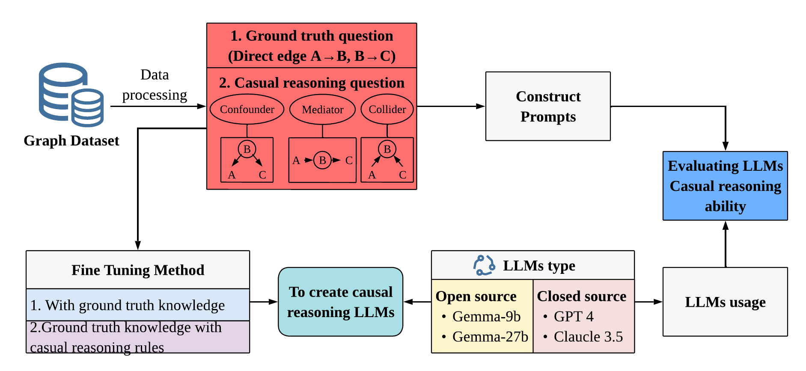
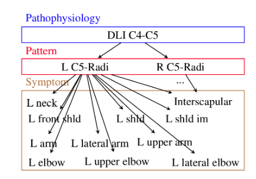

# Evaluating the Performance of LLMs in Causal Reasoning Using Causal Graphs

  
*Figure 1: Workflow Diagram*

## Table of Contents
- [Evaluating the Performance of LLMs in Causal Reasoning Using Causal Graphs](#evaluating-the-performance-of-llms-in-causal-reasoning-using-causal-graphs)
  - [Table of Contents](#table-of-contents)
  - [Data Composition](#data-composition)
  - [Graph Structure](#graph-structure)
    - [Pathophysiology → Pattern → Symptom](#pathophysiology--pattern--symptom)
      - [Pathophysiology](#pathophysiology)
      - [Pattern](#pattern)
      - [Symptom](#symptom)
  - [Experiment Overview](#experiment-overview)
    - [Part 1: Dataset Creation](#part-1-dataset-creation)
    - [Part 2: Testing Various Large Language Models](#part-2-testing-various-large-language-models)
    - [Part 3: Enhancing Causal Reasoning in LLMs](#part-3-enhancing-causal-reasoning-in-llms)
  - [Code Structure and Components](#code-structure-and-components)
    - [Dataset](#dataset)
    - [Model](#model)

## Data Composition

**Data Source:** NeurIPS 2019: Neuropathic Pain Diagnosis Simulator for Causal Discovery Algorithm Evaluation

The data comprises over 200 variables and approximately 800 well-defined causal relationships from 141 patient diagnostic records, evaluated by physicians.

  
*Figure 2: Graph Structure*

## Graph Structure
The graph is divided into three levels:

### Pathophysiology → Pattern → Symptom

#### Pathophysiology
- **Definition:** Pathophysiology is about the root cause of the condition.
- **In the Diagram:** The pathophysiological diagnosis is "DLI C4-C5," indicating a discoligamentous injury at the C4-C5 level of the cervical spine.

#### Pattern
- **Definition:** A pattern refers to the distribution and localization of symptoms fitting a certain condition.
- **In the Diagram:** Represented by "L C5-Radi" and "R C5-Radi," indicating radiculopathy at the C5 nerve root level.

#### Symptom
- **Definition:** Represents the actual experiences or complaints reported by the patient, caused by the pattern of the disease.
- **In the Diagram:** Symptoms include pain or discomfort in specific areas like the neck, shoulder, and arm.

## Experiment Overview

### Part 1: Dataset Creation
Constructed a dataset based on causal graphs specifically designed to test and train large language models (LLMs) on causal reasoning abilities. The dataset includes the following components:
1. **Ground-Truth Knowledge**: Basic causal knowledge essential for reasoning tasks.
2. **Collider**: Graphs structured as `A → B, C → B` to test understanding which one is the "collider."
3. **Mediator**: Graphs with a mediator structure like `A → (B) → C` to evaluate the ability to reason through intermediate variables.
4. **Confounder**: Graphs where `B → A, B → C` to assess recognition of confounding variables.

### Part 2: Testing Various Large Language Models
Tested the causal reasoning abilities of various LLMs, ranging from open-source models like Gemma2-9B and Gemma2-27B to proprietary models such as GPT-4 and Claude 3.5. The goal was to define the structure of prompts, standardize the output of answers, and explore ways to enhance LLM performance in causal reasoning tasks.

### Part 3: Enhancing Causal Reasoning in LLMs
This part focuses on improving LLMs’ causal reasoning capabilities, aiming to transform them into non-trivial models capable of providing better causal inference. The improvements were achieved through:
- **Prompt Engineering**: Defining the structure of prompts and standardizing outputs to improve causal reasoning through better question formulation.
- **Fine-Tuning**: Implementing two fine-tuning approaches:
  1. **Training with Ground-Truth Knowledge**: Models were trained using ground-truth knowledge and then tested on other causal reasoning tasks.
  2. **Enhanced Training**: Training with ground-truth knowledge followed by additional training with a small dataset focused on causal reasoning tasks.

## Code Structure and Components

### Dataset
The dataset folder includes:
- **Ground-Truth Edges and Nodes File**: Contains the base causal relationships used to construct causal graphs and test the LLMs' knowledge.
- **Data Processing File**: This file includes scripts to process raw data, generate different types of questions (collider, mediator, confounder).
- **Prompts File**: Created by the data processing scripts, this file defines structured prompts that are used to test the LLMs on various causal reasoning tasks.

### Model
The model folder includes:
- **Different Models and Fine-Tuned Models**: Contains various pre-trained models (e.g., Gemma2-9B, Gemma2-27B) and models that have been fine-tuned on the created dataset.
- **Model Answers and Performance**: Shows how each model performed on different types of prompts. This includes accuracy metrics, reasoning abilities, and comparative performance across different models and tasks.

---

This revised README structure ensures that all relevant sections are clear, well-organized, and easy to navigate, making it a comprehensive guide for users and collaborators to understand the scope and details of your project.